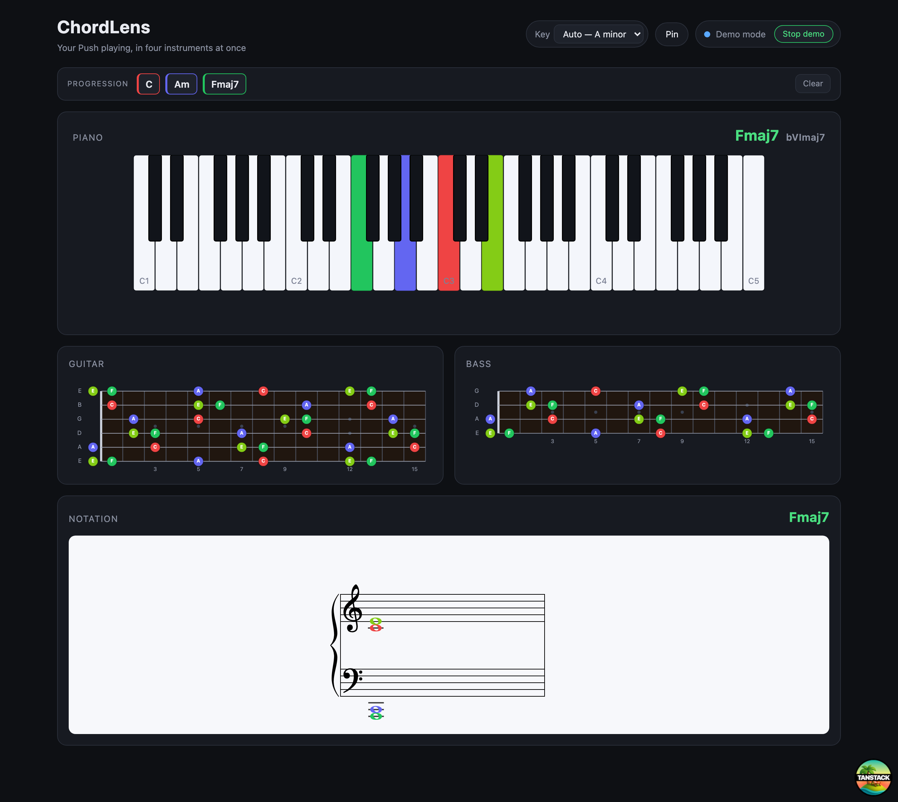

# ChordLens

A real-time visualizer that mirrors what you play on an Ableton **Push** controller across **four instrument views at once** — piano keyboard, guitar fretboard, bass fretboard, and standard music notation.

Play a chord on Push and immediately *see* it four ways: where it sits on a piano, how to finger it on guitar and bass, and how it's written on a grand staff. It's a passive, always-on "second screen" companion to Ableton Live — you don't operate it, you glance at it.



---

## Features

- **Four synchronized views** — piano keyboard (hero), guitar fretboard, bass fretboard, and a grand-staff notation view, all reflecting the held notes in real time.
- **A color per note** — each pitch has its own color, shared across *every* view (including the noteheads), so the same note is instantly recognizable on piano, guitar, bass, and the staff.
- **Live chord detection** — the detected chord symbol shows above the keyboard and on the staff (e.g. `Cmaj7`, `Am`, `G/B`).
- **Chord progression history** — a strip records the chords you settle on (`C · Am · Fmaj7`), each chip tinted by its root; **Clear** to reset.
- **Key & scale awareness** — auto-detects the key (with a manual override), shows the chord's **Roman numeral** (e.g. `IIm7 · V7 · I`), spells accidentals to match the key (sharps or flats), and flags **out-of-key** notes with a dashed outline.
- **Scale overlay** — the **Scale** toggle faintly traces the whole detected key across the piano and both fretboards, so you can see where your chord sits within the scale (played notes stay bold on top).
- **Pin / freeze a voicing** — press **Space** (or the **Pin** button) to freeze the current chord so you can study its shapes after letting go.
- **Demo mode** — cycles sample chords so you can see everything without any MIDI connected.

---

## How it works

ChordLens is a **single desktop app** (Tauri). Its Rust backend reads MIDI directly and streams note events to the React UI — no separate process, no WebSocket server, no terminal once it's built:

```
                ChordLens.app (Tauri desktop app)
   MIDI         ┌───────────────────────────────────────────┐
 ───────────▶   │  Rust backend (midir)   ──events──▶  React UI │
 keyboard       │  reads the chosen MIDI    {pitch,    Piano (hero) │
 or Ableton     │  input port               velocity}  Guitar · Bass │
 (via IAC bus)  │                                       Notation     │
                └───────────────────────────────────────────┘
```

- The Rust side enumerates MIDI inputs (keyboards, IAC buses, etc.), opens the one you pick, and emits a `midi-note` event per note on/off.
- The React side keeps the set of held notes and renders the four synchronized views.

Note event shape (Rust → UI): `{ pitch, velocity }` — `pitch` is a MIDI note 0–127, `velocity > 0` is a note-on, `velocity 0` is a note-off.

> **Where do notes come from?** A plugged-in MIDI keyboard works with zero setup — pick it and play. To visualize **Ableton** (Push, clips), route Live to a virtual MIDI bus (macOS **IAC**) and pick that bus in the app; see [Visualizing Ableton](#visualizing-ableton-live-via-iac) below. Ableton doesn't expose its notes to anything unless you route them somewhere — that one-time IAC step is unavoidable for any tool.

---

## Quick start (desktop app)

```bash
cd chordlens-app
npm install            # first time only
npm run desktop        # builds + launches the ChordLens desktop app (tauri dev)
```

A native window opens with the four-view layout. Top-right:

- Pick a **MIDI input** from the dropdown (your keyboard, or an IAC bus from Ableton) and play — the views light up.
- No MIDI handy? Click **Demo** to cycle sample chords and see all four views update.

To produce a distributable, double-click app bundle (`.app` / `.dmg`):

```bash
npm run desktop:build  # outputs to src-tauri/target/release/bundle/
```

<a id="visualizing-ableton-live-via-iac"></a>
### Visualizing Ableton Live (via IAC)

Ableton doesn't expose its notes to other apps unless you route them out. On macOS the built-in **IAC Driver** is a virtual MIDI cable for exactly this.

**1. Turn on the IAC bus (one-time):**
1. Open **Audio MIDI Setup** → menu **Window → Show MIDI Studio** (⌘2).
2. Double-click the **IAC Driver** icon.
3. Tick **"Device is online"** (a dimmed/red icon means it's off), confirm a port named **Bus 1** exists (add one with **+** if empty), click **Apply**.

**2. Enable the port in Ableton (one-time):**
- Live → **Settings → Link, Tempo & MIDI** → under **MIDI Ports**, set **Output: IAC Driver (Bus 1) → Track = On**.

**3. Route your track's MIDI to it:**
- Select the track you play into → set **MIDI To → IAC Driver (Bus 1)**, channel **1**, and **Monitor → In**.
- ⚠️ Routing a track's MIDI to IAC sends it *out* instead of to that track's instrument, so the track goes silent. To **hear sound and see it**, add a second MIDI track: **MIDI From → [instrument track]**, **Monitor: In**, **MIDI To → IAC Driver (Bus 1)**. The second track is a silent tap for ChordLens.

**4. Pick it in ChordLens:**
- Click **↻** next to the MIDI-input dropdown (it re-scans), then choose **IAC Driver Bus 1**. Play — the views light up.

> A plugged-in USB MIDI keyboard skips all of this: just pick it in the dropdown and play.

---

## Configuration

Musical settings are constants in [`chordlens-app/src/lib/config.ts`](chordlens-app/src/lib/config.ts) (runtime controls are the MIDI input picker, key override, pin, and demo toggle):

| Constant | Default | Meaning |
|----------|---------|---------|
| `OCTAVE_OFFSET` | `-2` | C3 = MIDI 60 (Ableton default). Set to `-1` if your Live uses C4 = 60. |
| `GUITAR_TUNING` | `E2 A2 D3 G3 B3 E4` | Standard 6-string. |
| `BASS_TUNING` | `E1 A1 D2 G2` | Standard 4-string. |
| `FRET_COUNT` | `15` | Frets drawn per neck. |
| `PIANO_LOW` / `PIANO_HIGH` | `36` / `84` | Keyboard span (C2–C6). |
| `CLEF_SPLIT` | `60` | Notes ≥ this go to the treble clef, below to bass. |

Accidentals are always **sharps** in v1 (no key-aware spelling yet).

---

## Project layout

```
chordlens-app/                  # Tauri desktop app (React UI + Rust backend)
  src/                          # React frontend (the four views)
    routes/index.tsx            # the single visualizer route "/" (wires every feature)
    hooks/
      usePushMidi.ts            # MIDI source: Tauri events from the Rust backend + demo mode
      useKeyEstimate.ts         # auto key detection (+ manual override)
      useChordHistory.ts        # records settled chords for the progression strip
    components/
      PianoView.tsx             # SVG keyboard (hero view)
      FretboardView.tsx         # reused for guitar AND bass
      NotationView.tsx          # VexFlow grand staff + chord symbol
      ProgressionStrip.tsx      # chord history chips
      KeyBadge.tsx              # detected key + manual override
      StatusIndicator.tsx       # listening / demo state
      InputPicker.tsx           # MIDI input chooser
    lib/
      music.ts                  # tonal wrappers: detectChord, noteName, pitchClass, fretPositionsFor
      theory.ts                 # key estimation, scale, Roman numerals, sharp/flat spelling
      colors.ts                 # one color per pitch-class (shared by all views)
      config.ts                 # constants (tunings, ranges, octave convention)
      *.test.ts                 # unit tests for music + theory
  src-tauri/                    # Rust backend
    src/lib.rs                  # midir MIDI reader; emits "midi-note" events; commands
    examples/list_midi.rs       # standalone MIDI-port enumeration check
    Cargo.toml, tauri.conf.json # Rust deps + app/window/bundle config
```

## Tech stack

- **Desktop shell:** [Tauri](https://tauri.app/) v2 — Rust backend, system WebView, small (~10 MB) bundle.
- **MIDI:** [`midir`](https://github.com/Boddlnagg/midir) (Rust) reads input ports on the backend and emits `midi-note` events to the UI. No cloud, no DB, no auth.
- **UI:** TanStack Router + React + TypeScript (Vite).
- **Notation:** [VexFlow](https://www.vexflow.com/) (live grand-staff chord rendering).
- **Music theory:** [tonal](https://github.com/tonaljs/tonal) — `Chord.detect` for chords, `Key`/`Scale`/`Progression` for key detection, scales, and Roman numerals.
- **Piano / guitar / bass:** plain SVG driven by React state.

## Requirements

- **Run the desktop app / build from source:** [Rust toolchain](https://rustup.rs/) + Xcode Command Line Tools (macOS), and Node 18+.
- **Visualize Ableton:** macOS (uses the built-in IAC Driver). A USB MIDI keyboard needs no extra setup on any platform Tauri supports.

## Testing

```bash
cd chordlens-app
npm test             # runs the music-logic unit tests (vitest)
```

The chord-detection, note-naming, and fretboard-position logic in `lib/music.ts` is covered by unit tests.

---

## Scope

Started as a passive real-time mirror; the Features above (color, progression history, key awareness, pin) have since been added. Still **parked**:

- Playback visualization of recorded clips synced to Live's transport (where [OSMD](https://opensheetmusicdisplay.org/) would replace VexFlow).
- Cycling / selecting a single guitar or bass fingering (currently lights **all** matching positions).
- Per-note "correct" enharmonic spelling within a key (currently spells sharps or flats per the key signature, not per individual note).
- Alternate tunings (drop D, 5-string bass, custom).
- Saving / exporting progressions or notation (where TanStack server functions would come in).
- Left-handed layouts.
- Tightest hybrid packaging (auto-launch / single installer / signing).

> **Notes on the architecture vs. the original spec:**
> - The spec described a browser web app fed by a Max for Live device over WebSocket. To make it **install-once / standalone**, it's a **Tauri desktop app** that reads MIDI natively in Rust — the Max device and WebSocket path have been removed. (MIDI is read in the Rust backend, *not* via the browser Web MIDI API — macOS's WebView doesn't support Web MIDI.)
> - The frontend is TanStack **Router** (client-side SPA), not TanStack **Start**. v1 needs no SSR/server functions; Start can be layered in for v2's saving/playback features.
