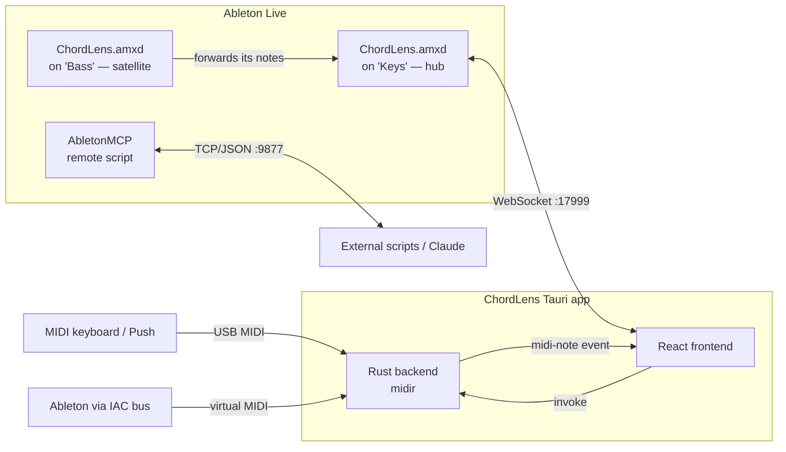
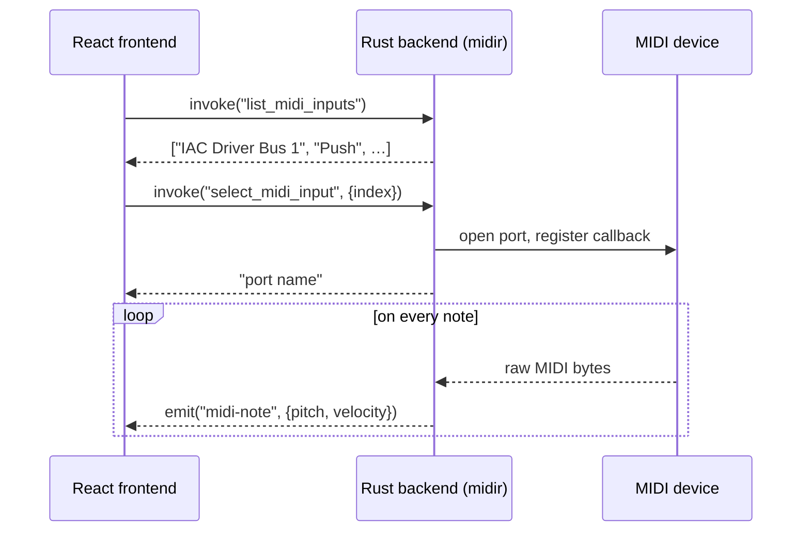
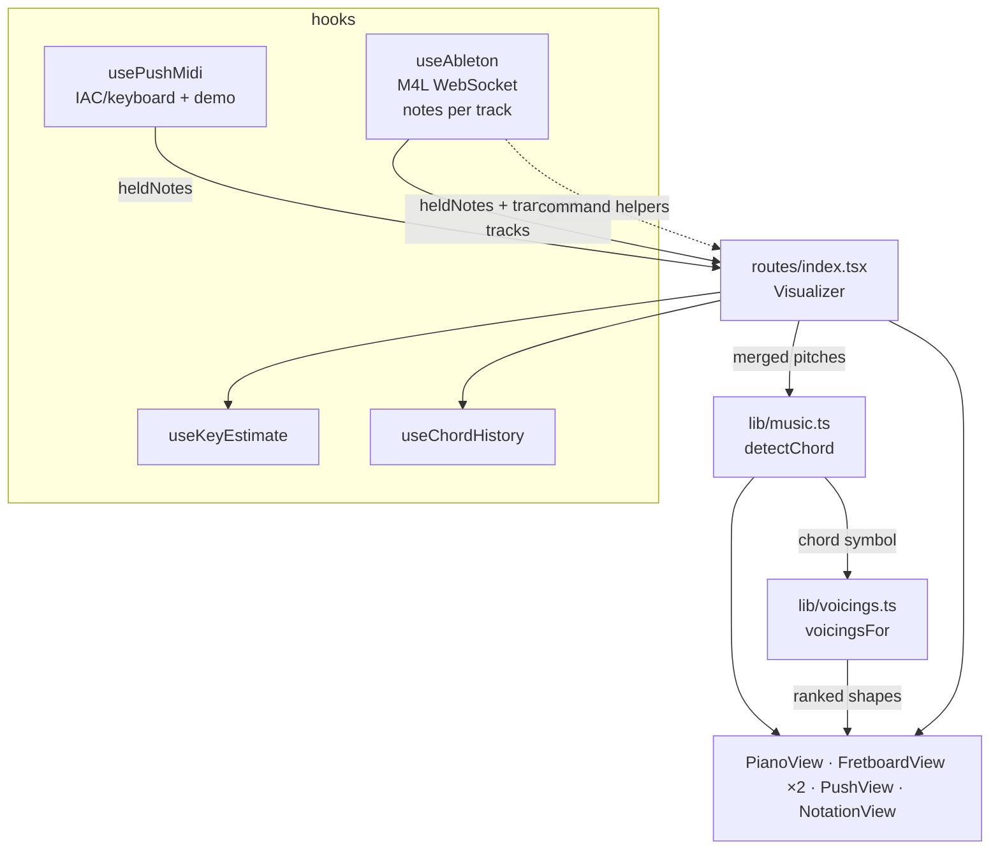
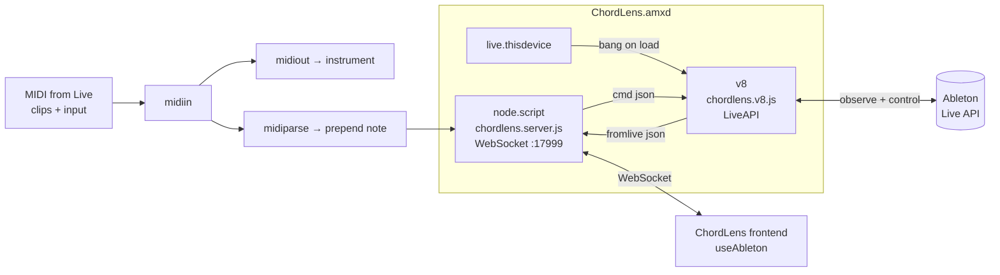
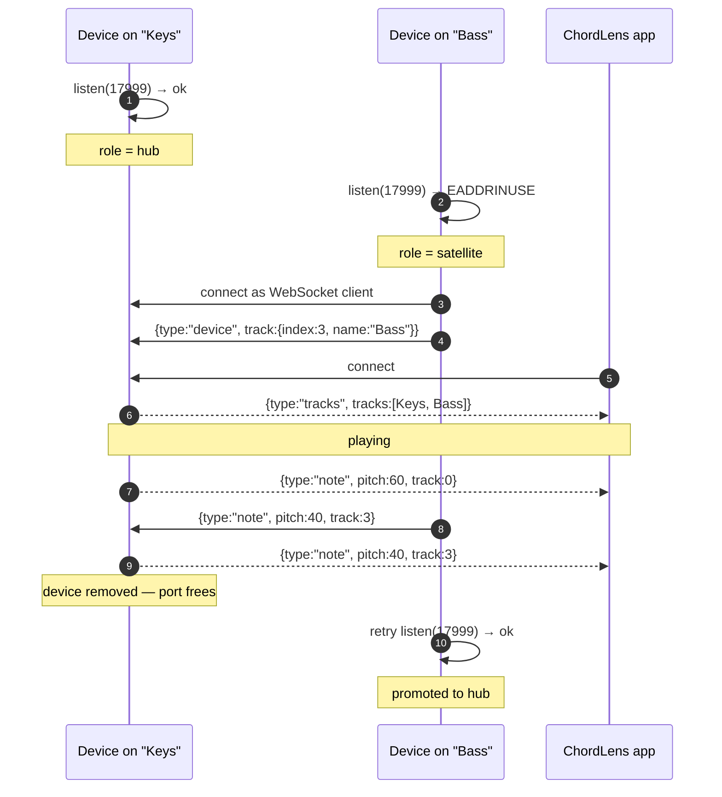
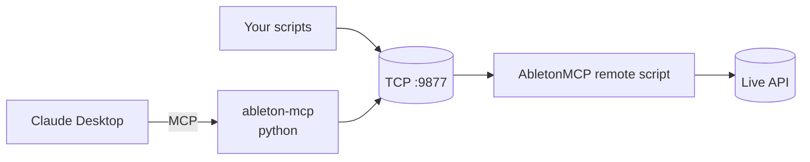
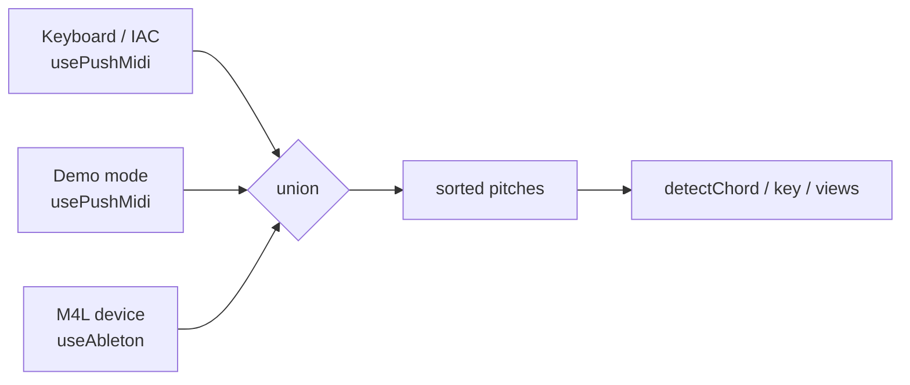

# ChordLens — Architecture

ChordLens is a desktop app that watches what you play on a MIDI instrument and
renders it live across four views (piano, guitar, bass, notation) with chord and
key detection. It also talks **to** Ableton Live so the app can read transport
state and drive Live (tempo, clips, tracks).

This document describes how the pieces fit together.

- [System context](#system-context)
- [The Tauri app](#the-tauri-app)
  - [Rust backend (native MIDI)](#rust-backend-native-midi)
  - [React frontend](#react-frontend)
- [Ableton integration](#ableton-integration)
  - [Path A — Max for Live device (primary)](#path-a--max-for-live-device-primary)
  - [Several tracks at once](#several-tracks-at-once)
  - [Path B — AbletonMCP socket (LLM / scripting)](#path-b--abletonmcp-socket-llm--scripting)
- [Note sources, merged](#note-sources-merged)
- [Protocols](#protocols)
- [File map](#file-map)
- [Design decisions](#design-decisions)
- [Runtime checklist](#runtime-checklist)

---

## System context

There are three ways MIDI/Ableton data can reach ChordLens, and one way the app
reaches back into Ableton.



One device goes on each track you want to watch. They elect a hub so the app
keeps a single connection while seeing every track — see
[Several tracks at once](#several-tracks-at-once).

Two independent bridges into Live coexist (different ports, different
mechanisms):

| Bridge | Port | Transport | Who drives it | Live API access |
|--------|------|-----------|---------------|-----------------|
| **Max for Live device** | 17999 | WebSocket / JSON | the ChordLens frontend | official `LiveAPI` (v8) |
| **AbletonMCP remote script** | 9877 | TCP / JSON | external code, Claude (MCP) | `_Framework` control surface |

---

## The Tauri app

`chordlens-app/` is a [Tauri 2](https://tauri.app) desktop app: a Rust backend
(`src-tauri/`) hosting a system WebView that runs the React/TypeScript frontend
(`src/`). In a plain browser (`npm run dev`) the frontend still runs, but native
MIDI is unavailable — only demo mode and the WebSocket bridge work there.

### Rust backend (native MIDI)

`src-tauri/src/lib.rs` reads MIDI directly with [`midir`](https://crates.io/crates/midir)
— no helper process. It exposes three Tauri commands and emits one event.



- **Commands:** `list_midi_inputs`, `select_midi_input(index)`,
  `disconnect_midi`.
- **Event:** `midi-note` → `{ pitch: u8, velocity: u8 }`. Note-off is
  normalized to `velocity: 0`. SysEx / clock / active-sensing are ignored.
- The open `MidiInputConnection` is kept in `MidiState(Mutex<…>)` so its callback
  thread stays alive; selecting a new input drops the previous connection.

### React frontend

`src/` is React 19 + TanStack Router, built by Vite. The chord/key logic is pure
functions in `src/lib/` (unit-tested with Vitest). State flows through hooks into
presentational view components.



- **`routes/index.tsx` (`Visualizer`)** is the composition root: it pulls notes
  from both input hooks, merges them, runs chord/key detection, and renders the
  views plus header chrome.
- **`lib/music.ts` / `lib/theory.ts`** — pitch→chord/key detection and roman
  numerals (provider-agnostic, fully tested).
- **`lib/voicings.ts`** — turns a chord symbol into ranked, playable guitar
  shapes. See [Chord shapes](#chord-shapes).
- **`lib/config.ts`** — static MVP config (octave convention, tunings, ranges).

#### Chord shapes

The fretboard's default view answers *where do these notes live* — it lights
every position matching a held pitch-class. Chord mode answers the guitarist's
question instead: *what do I grab?*

`voicingsFor(symbol, tuning, fretCount)` searches actual fingerings — a fret or
a mute per string — at every hand position on the neck, discards what a hand
can't hold (>4 fingers after barre detection, >4-fret span, inner mutes, missing
chord tones), and ranks the rest. Scoring is calibrated in *fingers*, with
penalties for the marks of a search artifact rather than a chord: unisons on
adjacent strings, crossed voices, two fingers pinned to one fret they can't be
barred across, inversions of a chord that named no bass. A barre is only chosen
when it beats using the fingers.

The results are then spread across the neck — shapes within three frets of an
already-chosen grip are skipped — because the eight best C shapes are otherwise
eight ways to fret the same open chord. What surfaces is the CAGED system,
falling out of the search rather than being tabulated: C gives `x32010` /
`x35553` / `8aa988`, G gives `320003` / `355433`, Am gives `x02210` / `577555`.
`FretboardView` draws three positions at once, each boxed and labelled.

---

## Ableton integration

### Path A — Max for Live device (primary)

The `max-for-live/ChordLens.amxd` device runs **inside** Ableton and is the
app's main link to Live. It does two jobs: forward played MIDI to the app (no
IAC bus needed) and bridge the Live API for state + control.

The device is split across two scripts because of a hard platform constraint:

> Only the Max **`v8`/`js`** object can touch the **Live API**.
> Only **`node.script`** can host a **WebSocket** server.

So they run side by side and talk over Max messages inside the patch.



Internal message contract (over Max patch cords):

- `node.script` → `v8`: `cmd <jsonString>` (a command from the app).
- `v8` → `node.script`: `fromlive <jsonString>` (an event or command reply).
- `midiin → midiparse → prepend note` → `node.script`: `note <pitch> <velocity>`.

Two non-obvious constraints this design works around (both cost real debugging):

- **Capture from `midiin`, not `notein`.** `notein` only receives physical MIDI
  *ports*, so it misses clip playback. `midiin` carries Live's track MIDI stream
  (clips + input). A parallel `midiin → midiout` keeps the device transparent to
  the instrument after it.
- **`LiveAPI` needs the two-arg form** `new LiveAPI(callback, path)`. In the
  `v8` object a lone string arg is taken as the callback, leaving the path unset
  (`get: no valid object set`). `chordlens.v8.js` wraps this in an `api()` helper.

`v8` registers `LiveAPI` observers for `is_playing` and `tempo` so changes are
**pushed** (no polling), and runs commands via `LiveAPI.call/set` against
`live_set …` paths. `node.script` caches the last session/transport so a freshly
connected client gets state immediately.

On the app side, **`useAbleton`** (`src/hooks/useAbleton.ts`) wraps the
auto-reconnecting **`AbletonBridge`** client (`src/lib/ableton.ts`) and exposes
`connected`, `session`, `tempo`, `isPlaying`, `heldNotes`/`pitches`, plus typed
command helpers (`setTempo`, `fireClip`, `createMidiTrack`, …). The
**`AbletonStatus`** header chip surfaces connection + tempo and a transport
play/stop toggle.

See [`max-for-live/README.md`](../max-for-live/README.md) for the device build
steps and full WebSocket protocol.

### Several tracks at once

A device on one track only ever sees that track's MIDI, so watching a bass line
and a pad together means a device on each. Every copy runs its own
`node.script`, and they all want port 17999 — so they elect roles rather than
letting the first one win and the rest fail silently.



- **Track identity.** `chordlens.v8.js` walks up from `this_device` through
  `canonical_parent` until it reaches `live_set tracks N` (several hops if the
  device sits inside a rack), and observes the track's `name` plus the set's
  `tracks` list so renames and reordering are picked up. `node.script` stamps
  that index onto every note it publishes.
- **Relaying.** A satellite forwards only its own `note` and `device` messages.
  Song-wide state — transport, tempo, key, session — is reported by the hub
  alone, or the app would get one copy per device.
- **Failover.** Losing the hub connection puts a satellite back into the
  election after ~2s; whichever grabs the port becomes the new hub.
- **Testing.** `max-for-live/test/` runs two real bridges as forked processes
  with `max-api` stubbed (it exists only inside Node-for-Max), covering
  election, relaying, deduplication and failover — the behaviour that can't be
  eyeballed inside Ableton. `npm test` in that folder.

On the app side, notes are kept per track (`applyNote` / `heldFor` in
`lib/ableton.ts`), and the header grows a **`TrackPicker`** once a second device
appears: follow one track, or fold them all into one chord.

### Path B — AbletonMCP socket (LLM / scripting)

[AbletonMCP](https://github.com/ahujasid/ableton-mcp) is an **independent**
integration used for LLM/automation, not by the ChordLens UI. Its remote script
(installed into Ableton's `MIDI Remote Scripts`) opens a TCP server on **9877**
speaking JSON `{type, params}`. The `ableton-mcp` Python package is one client
(bridging MCP ↔ socket for Claude Desktop); any external program can be another.



This path is documented for completeness and for ad-hoc scripting. ChordLens
features should use **Path A**, which is more native (official Live API,
observers, no app-bundle install, no IAC bus).

---

## Note sources, merged

The visualizer treats any of three note sources interchangeably. They are
unioned in `routes/index.tsx` so a held pitch from any source lights the views:



```ts
const heldNotes = useMemo(() => {
  if (live.heldNotes.size === 0) return midiHeld
  if (midiHeld.size === 0) return live.heldNotes
  const merged = new Set(midiHeld)
  live.heldNotes.forEach((n) => merged.add(n))
  return merged
}, [midiHeld, live.heldNotes])
```

---

## Protocols

### `midi-note` (Rust → frontend, Tauri event)
`{ pitch: number, velocity: number }` — `velocity: 0` means note-off.

### Max for Live WebSocket (device ⇄ frontend, `ws://127.0.0.1:17999`)
JSON, one object per message. The server is **dependency-free** — implemented
with Node's built-in `http` + `crypto` (no `ws`, no `node_modules`). Authoritative
reference in [`max-for-live/README.md`](../max-for-live/README.md).

- **Device → app events:** `hello`, `note`, `tracks`, `transport`, `tempo`,
  `key`, `session`, `pong`, `error`. (`note` carries the `track` index it came
  from, or `null`; `tracks` is the roster of tracks feeding the hub; `key` =
  `{rootPc, scaleName}`; `session` includes `rootPc`/`scaleName`.)
- **App → device commands:** `get_session`, `set_tempo`, `start_playback`,
  `stop_playback`, `create_midi_track`, `set_track_name`, `fire_clip`,
  `stop_clip`, `get_track_info`, `ping`. An optional numeric `id` yields a
  `{id, ok, result}` / `{id, error}` reply.

### AbletonMCP socket (clients ⇄ remote script, `tcp://localhost:9877`)
Request `{ "type": <cmd>, "params": {…} }` → response
`{ "status": "success"|"error", "result"|"message" }`. One request/response per
connection (naïve buffer framing).

---

## File map

```
first-ableton-app/
├─ chordlens-app/                 # the Tauri desktop app
│  ├─ src-tauri/src/lib.rs        # Rust: native MIDI (midir) → "midi-note" event
│  └─ src/
│     ├─ routes/index.tsx         # Visualizer — composition root, note merge
│     ├─ hooks/
│     │  ├─ usePushMidi.ts        # IAC/keyboard + demo note source
│     │  └─ useAbleton.ts         # Max for Live WebSocket bridge (React)
│     ├─ lib/
│     │  ├─ ableton.ts            # AbletonBridge client, types, per-track notes
│     │  ├─ music.ts / theory.ts  # chord/key detection (pure, tested)
│     │  ├─ voicings.ts           # chord symbol → ranked playable guitar shapes
│     │  └─ config.ts             # static MVP config
│     └─ components/
│        ├─ AbletonStatus.tsx     # header chip: connection + tempo + transport
│        ├─ StatusIndicator.tsx   # MIDI input status
│        ├─ TrackPicker.tsx       # which Ableton track the views follow
│        └─ {Piano,Fretboard,Push,Notation}View.tsx, …
├─ max-for-live/                  # the Ableton-side device (Path A)
│  ├─ ChordLens.maxpat            # patch wiring (assemble → ChordLens.amxd)
│  ├─ chordlens.v8.js             # LiveAPI: observe transport/tempo/key + track identity (v8)
│  ├─ chordlens.server.js         # dependency-free WebSocket server, hub/satellite (node.script)
│  ├─ test/                       # two real bridges, max-api stubbed (`npm test`)
│  ├─ package.json                # metadata + test script (no dependencies)
│  └─ README.md                   # device build steps + protocol
├─ docs/                          # this documentation
└─ resources/                     # product / requirements / spec notes
```

---

## Design decisions

- **Native MIDI in Rust, not WebMIDI.** The desktop build reads MIDI directly
  via `midir` with no helper process or browser permission prompts; the frontend
  just consumes `midi-note` events.
- **Max for Live over the MCP socket for app features.** M4L uses the official
  Live API (with observers), sees played notes directly (no IAC bus), needs no
  app-bundle install, and is stable across Live updates. The MCP socket is kept
  only for external/LLM scripting. (See `docs/` discussion / commit history.)
- **Two JS files in the device.** Forced by the platform: LiveAPI lives in `v8`,
  WebSocket hosting lives in `node.script`; they bridge over Max messages.
- **Merged note sources.** The visualizer is agnostic to where notes come from,
  so keyboard, demo, and the M4L device all "just work" and even combine.
- **Devices elect a hub instead of competing for the port.** One fixed port is
  what makes the app's connection simple; having the losers join the winner
  keeps that simplicity while still supporting a device per track. The
  alternative — a port per device — would push discovery into the app.
- **Notes are bucketed per track, not pooled.** A bass line and a pad arriving
  together are two parts; pooling them would read as one nine-note chord.
- **Chord shapes are searched, not tabulated.** A shape dictionary would only
  cover the chords someone thought to enter; searching real fingerings and
  scoring them for playability handles any symbol `tonal` can parse, including
  slash chords and extensions.
- **Auto-reconnecting bridge.** `AbletonBridge` retries, so app/Ableton launch
  order doesn't matter and the UI degrades gracefully when Live is closed.
- **Local-only by default.** Both the WebSocket (`127.0.0.1`) and the MCP socket
  are intended for local use; neither has auth.

---

## Runtime checklist

To run the full system:

1. **Build the device once:** assemble `max-for-live/ChordLens.amxd` (see its
   README) — it's dependency-free, so there's **no `npm install`**. Optionally
   **Freeze** it for a portable, self-contained device.
2. **In Ableton:** drop `ChordLens.amxd` on a MIDI track; the Max console should
   print `ChordLens hub listening on ws://127.0.0.1:17999 (track 0: …)`. Add it
   to more tracks to watch them too — those print
   `joining it as a satellite`, which is the healthy path, not an error.
3. **Run the app:** `cd chordlens-app && npm run desktop` (native MIDI) or
   `npm run dev` (browser; WebSocket bridge + demo only).
4. The `AbletonStatus` chip connects automatically; play into the device or a
   selected MIDI input and the views light up. With devices on more than one
   track, the header's track picker chooses which one the views follow.
