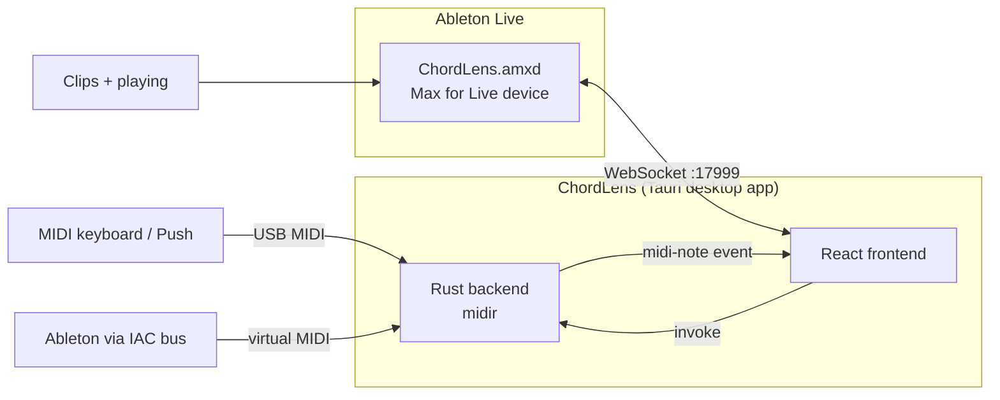
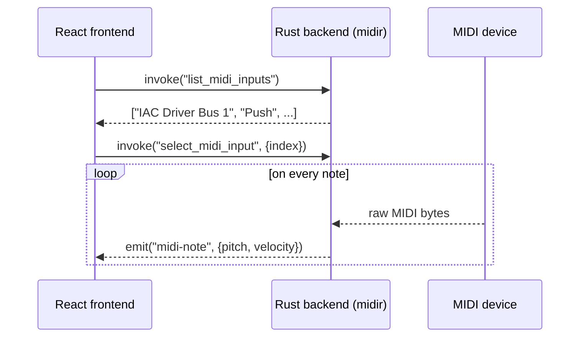
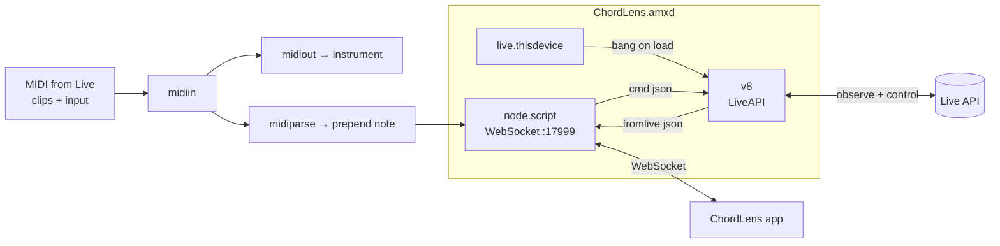

**TL;DR**

- ChordLens is a Tauri desktop app that mirrors what you play into Ableton across four views at once — piano, guitar, bass, and notation — with live chord and key detection.
- The core app reads MIDI natively in **Rust** (via `midir`) and renders the UI in **React**, so there's no helper process and no browser MIDI permissions.
- An optional **Max for Live device** connects Ableton directly: it taps the track's MIDI (clips included) and bridges the **Live API**, streaming everything to the app over a local **WebSocket** — no IAC bus required.
- The device is split into two scripts on purpose: only Max's `v8` object can touch the Live API, and only `node.script` can host a WebSocket — they talk over Max messages.
- Setup is two parts: run the desktop app, then paste-and-save the Max patch once to build `ChordLens.amxd`.

## What is ChordLens?

ChordLens is a passive "second screen" for Ableton Live. You play a chord — on a Push, a keyboard, or a clip — and it instantly shows you that chord four ways: where it sits on a **piano**, how to finger it on **guitar** and **bass**, and how it's written on a **grand staff**. It also detects the chord symbol, estimates the key, and shows Roman numerals and the scale.

This post walks through how it's built and how to set it up — including the part most people get stuck on: adding the Max for Live device that lets the app talk to Ableton.

## The architecture at a glance

There are two layers. The **desktop app** is self-contained and works with any MIDI source. The **Max for Live bridge** is optional and unlocks the deepest integration (clip playback, live tempo/transport, and controlling Live back).



The two paths into the app are interchangeable: a held note from a keyboard, the IAC bus, or the Max device all flow into the same "held notes" set that drives every view.

## The desktop app: Tauri + native MIDI in Rust

[Tauri](https://tauri.app/) packages a Rust backend with a system WebView running a web frontend, producing a small (~10 MB) cross-platform binary. For MIDI, the Rust side uses [`midir`](https://crates.io/crates/midir), a cross-platform realtime MIDI library — the same crate behind community projects like the `tauri-plugin-midi` WebMIDI shim.

Reading MIDI in Rust (instead of the browser's Web MIDI API) matters on macOS, where the system WebView doesn't support Web MIDI at all. The backend enumerates input ports, opens the one you pick, and emits a `midi-note` event per note on/off:

```rust
// src-tauri/src/lib.rs (excerpt)
let connection = midi_in.connect(
    port,
    "chordlens-read",
    move |_timestamp, message, _| {
        if message.len() < 3 { return; }
        let status = message[0] & 0xF0;
        let pitch = message[1];
        let velocity = message[2];
        let event = match status {
            0x90 => Some(NoteEvent { pitch, velocity }),   // note-on (vel 0 = off)
            0x80 => Some(NoteEvent { pitch, velocity: 0 }), // note-off
            _ => None,
        };
        if let Some(event) = event {
            let _ = emitter.emit("midi-note", event); // → React
        }
    },
    (),
)?;
```

The frontend subscribes to that event and keeps a `Set` of held notes:



## Chord and key detection in the frontend

All the musical logic is pure TypeScript in `src/lib/`, unit-tested with Vitest, and powered by [tonal](https://github.com/tonaljs/tonal). Notation is rendered with [VexFlow](https://www.vexflow.com/). Keeping detection in pure functions means the views just take a set of pitches and render — they don't care where the notes came from:

```ts
import { Chord } from 'tonal'

// Held MIDI pitches -> a chord symbol like "Dm7/A"
const names = [...heldNotes].sort((a, b) => a - b).map(noteName)
const [symbol] = Chord.detect(names, { assumePerfectFifth: true })
```

A slowly-adapting histogram of recent pitch-classes estimates the key, which then drives Roman numerals, sharp/flat spelling, and the scale overlay.

## Connecting Ableton: the Max for Live bridge

Here's the interesting part. Ableton doesn't expose its notes or state to other apps unless you route them out. The classic trick is a virtual MIDI cable (macOS **IAC**), but that only carries notes — not tempo, transport, or any way to control Live.

[Max for Live](https://help.ableton.com/hc/en-us/articles/5402681764242-Controlling-Live-using-Max-for-Live) does much more. A Max device lives *inside* Ableton and can both read the **Live Object Model** (the official API for tracks, clips, transport, devices) and host a network server. ChordLens uses a small Max MIDI Effect device that does exactly that.

The device is deliberately split into two scripts, because of two hard platform constraints:

- **Only Max's `v8`/`js` object can use `LiveAPI`** — `node.script` can't.
- **Only `node.script` can host a WebSocket** — the `js`/`v8` objects can't.

So they run side by side and pass messages to each other inside the patch:



The MIDI tap is `midiin → midiparse → prepend note → node.script`. The `node.script` side hosts the WebSocket using the `max-api` module that Max injects at runtime (note: the `max-api` package on npm is just a placeholder — Max provides the real one):

```js
// chordlens.server.js (node.script)
const Max = require('max-api')
const { WebSocketServer } = require('ws')
const wss = new WebSocketServer({ host: '127.0.0.1', port: 17999 })

// MIDI note from the patch -> broadcast to the app
Max.addHandler('note', (pitch, velocity) => {
  broadcast({ type: 'note', pitch: Number(pitch), velocity: Number(velocity) })
})
// A command from the app -> forward to the v8 LiveAPI bridge
Max.outlet('cmd', JSON.stringify({ type: 'set_tempo', tempo: 128 }))
```

The `v8` side observes transport and runs commands. One gotcha: **you cannot use `LiveAPI` in global code** — you must wait for `live.thisdevice` to fire — and in the `v8` object the constructor needs the two-argument form, or the path silently fails to resolve:

```js
// chordlens.v8.js
function noop() {}
function api(path) {
  // Two-arg form (callback, path). A lone string is read as the callback,
  // which leaves the path unset -> "get: no valid object set".
  return new LiveAPI(noop, path)
}

function setTempo(bpm) {
  api('live_set').set('tempo', bpm)
}
```

On the app side, an auto-reconnecting WebSocket client wraps it all in a typed hook:

```ts
const live = useAbleton() // ws://127.0.0.1:17999 by default
// live.connected, live.tempo, live.isPlaying
// live.pitches      ← notes from the device (no IAC bus)
// live.setTempo(128), live.fireClip(0, 0), live.startPlayback()
```

## Setting it up, part 1: run the desktop app

You need Node 18+, the [Rust toolchain](https://rustup.rs/), and (on macOS) Xcode Command Line Tools.

```bash
cd chordlens-app
npm install          # first time only
npm run desktop      # builds + launches the Tauri app (tauri dev)
```

A native window opens with the four views. Pick a **MIDI input** from the dropdown and play, or hit **Demo** to cycle sample chords with nothing connected. That's the whole app — the Max device below is optional.

## Setting it up, part 2: add the Max for Live device

This is the step that adds clip-playback capture, live tempo/transport, and control over Live. You build the device once in the Max editor (devices are binary `.amxd` files, so they can't ship as plain text). Live Suite includes Max for Live; Standard needs the add-on.

**1. Install the WebSocket dependency** (the device's `node.script` needs `ws`):

```bash
cd max-for-live
npm install
```

**2. Copy the patch to your clipboard:**

```bash
cat max-for-live/ChordLens.maxpat | pbcopy   # macOS
```

**3. Create the device and paste the patch:**

1. In Ableton, drag a **Max MIDI Effect** onto a MIDI track (Browser → **Max for Live → Max MIDI Effect**).
2. Click the device's **edit (✏️) button** — the Max editor opens showing the default `midiin → midiout`.
3. In the editor: **⌘A** (Select All) → **Delete** → **⌘V** (Paste). The ChordLens objects appear (`midiin`, `midiout`, `midiparse`, `prepend note`, `node.script`, `v8`, `live.thisdevice`).
4. **⌘S** → save as **`ChordLens.amxd`** in the `max-for-live/` folder, so it sits next to the `.js` files and `node_modules/`.
5. Close the editor.

> The whole patch is self-contained — it includes its own `midiin → midiout` passthrough, so replacing the template wholesale gives you exactly one of each object and keeps MIDI flowing to your instrument.

**4. Verify it's live:**

- The Max Console should print `ChordLens WebSocket listening on ws://127.0.0.1:17999`.
- Or check the OS: `lsof -nP -iTCP:17999 -sTCP:LISTEN`.
- In ChordLens, the **Ableton** chip turns green and shows live BPM. Hit **Play** in Ableton and clip notes light up the views.

## Two gotchas worth knowing

If you adapt this for your own device, these two cost real debugging time:

1. **Capture from `midiin`, not `notein`.** `notein` only hears physical MIDI *ports*, so it works when you play a controller but shows **nothing during clip playback**. `midiin` carries Live's actual track MIDI stream (clips + input). The fix is the `midiin → midiparse` tap.
2. **`LiveAPI` needs the two-arg constructor** `new LiveAPI(callback, path)`, and it can't run in global code — wait for `live.thisdevice`. A lone string argument is interpreted as the callback, leaving the path unset and every `.get()` failing with `get: no valid object set`.

## Wrapping up

The pattern here generalizes well: a **native shell for the heavy lifting** (Rust + Tauri for MIDI and packaging), a **web frontend for the UI** (React + tonal + VexFlow), and a **Max for Live device as a clean, official bridge** into Ableton over a simple WebSocket protocol. Each layer does what it's best at, and the WebSocket contract keeps them decoupled — you can swap the UI, extend the device with new Live API commands, or drive Ableton from any other client without touching the rest.

If you want to go deeper, the device is easy to extend: add a `case` to the `v8` dispatch using a Live Object Model path, and a matching typed command on the client. Tempo nudges, clip-launch grids, and "record what I just played into a new MIDI clip" are all a few lines away.

**Citations**

- Controlling Live using Max for Live – Ableton: https://help.ableton.com/hc/en-us/articles/5402681764242-Controlling-Live-using-Max-for-Live
- Creating Devices that use the Live API – Max Documentation: https://docs.cycling74.com/max8/vignettes/live_api
- The LiveAPI Object – Max Documentation: https://docs.cycling74.com/legacy/max8/vignettes/jsliveapi
- JavaScript (V8) in Ableton Live: The Live API – Adam Murray: https://adammurray.link/max-for-live/v8-in-live/live-api/
- node.script Reference – Max Documentation: https://docs.cycling74.com/legacy/max8/refpages/node.script
- max-api – npm: https://www.npmjs.com/package/max-api
- Tauri 2.0: https://tauri.app/
- midir – crates.io: https://crates.io/crates/midir
- tonal: https://github.com/tonaljs/tonal
- VexFlow: https://www.vexflow.com/
